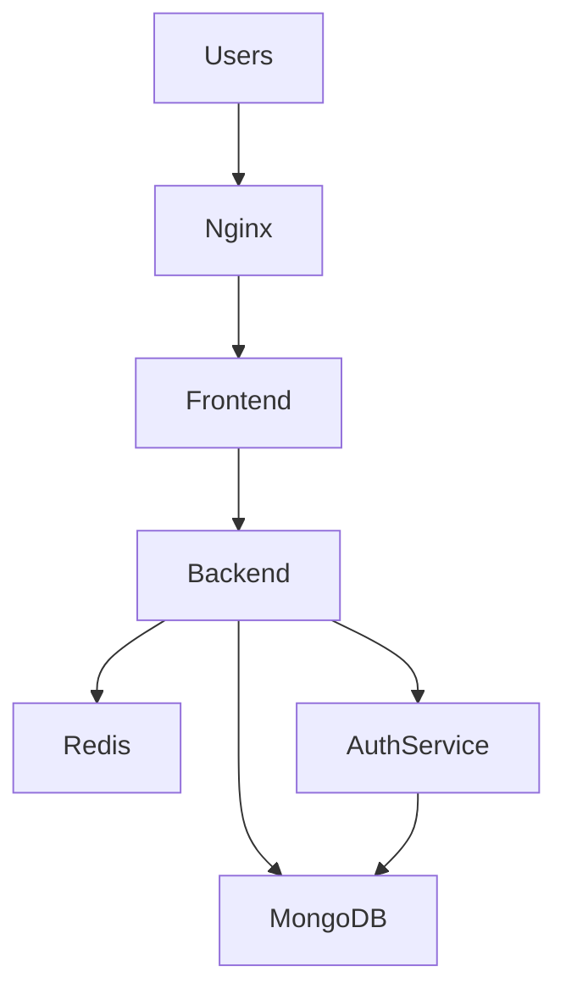

# Student Internship Portal

A production-oriented full-stack platform designed to help students discover legitimate internships while enabling administrators to manage job listings and applications efficiently.

This project focuses on building **secure authentication, scalable backend APIs, and production-ready infrastructure patterns**.

It was built as a practical exploration of **backend architecture, authentication systems, and deployment workflows**.

## Live Demo

Frontend  
http://72.61.243.51

Backend API  
http://72.61.243.51/api

## System Architecture


---
## Engineering Highlights

• JWT authentication with refresh token rotation  
• Role-based authorization system (Student / Admin)  
• Redis caching layer for frequently accessed resources  
• Rate limiting for API protection  
• Modular backend architecture using Express  
• Input validation with Zod  
• Full-stack architecture using Next.js App Router

## Features

### Authentication
- JWT-based access tokens
- Refresh token rotation
- Secure cookie handling
- Role-based access (Student / Admin)

### Student
- View active internships
- Apply to jobs
- View and delete own applications

### Admin
- Create and update job postings
- View own jobs
- View applications per job
- Review and update application status

## Security Considerations

• JWT access tokens with refresh token rotation  
• HTTP-only secure cookies for authentication  
• Rate limiting to prevent abuse  
• Input validation with Zod schemas  
• CORS protection

---

## Tech Stack

### Backend
- Node.js + Express
- MongoDB + Mongoose
- Redis
- JWT Authentication
- Zod Validation

### Frontend
- Next.js (App Router, React)
- Tailwind CSS v4 + shadcn/ui-inspired components
- Axios (with automatic token refresh)
- Zod for client-side validation

---

## Project Structure
```
student-internship-portal/
├── backend/
│ ├── controllers/ # Core Business logic
│ ├── routes/ # API route defiations
│ ├── middleware/ # Auth, validation, rate limiting
│ ├── models/ # MongoDB schemas
│ ├── config/ # Redis and database configs
│ └── server.js
└── frontend/
   ├── app/              # Next.js routes (admin, student, auth)
   ├── components/       # Shared components and UI primitives
   └── lib/              # API client, EdgeStore, utilities
```
---
## Deployment

The platform is deployed using a VPS environment with containerized services.

Infrastructure includes:

• Docker containers for backend services  
• Redis container for caching and rate limiting  
• Nginx reverse proxy for routing and security  
• MongoDB database for persistent storage

---

## Setup

### 1. Backend

See `backend/Readme.md` for full backend setup instructions.

High level:

```bash
cd backend
npm install
npm run dev
```

The API will run at `http://127.0.0.1:3001` (base URL `http://127.0.0.1:3001/api`).

### 2. Frontend

```bash
cd frontend
npm install
npm run dev
```

The Next.js app will run at `http://localhost:3000` and is configured to talk to the backend at `http://localhost:3001/api` via `lib/api.ts`.

---

## Phase 2 Roadmap (High-Level)

Planned improvements for the next phase include:

- **Event-driven architecture** for key domain events (e.g. job created, application submitted/updated)
- **Client-side caching** for jobs and applications (React Query/SWR) to reduce latency and improve UX
- Enhanced **observability and logging** for production (structured logs, metrics)
- Additional **UI/UX polish**, accessibility improvements, and admin/student features built on top of the current foundation
